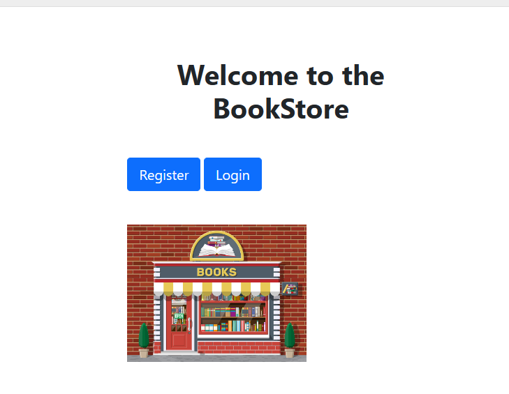
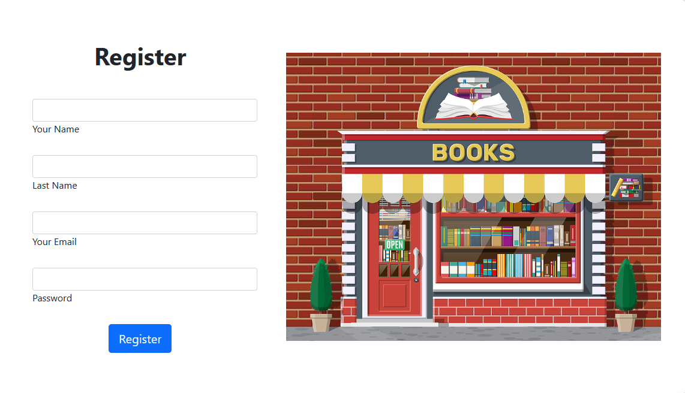
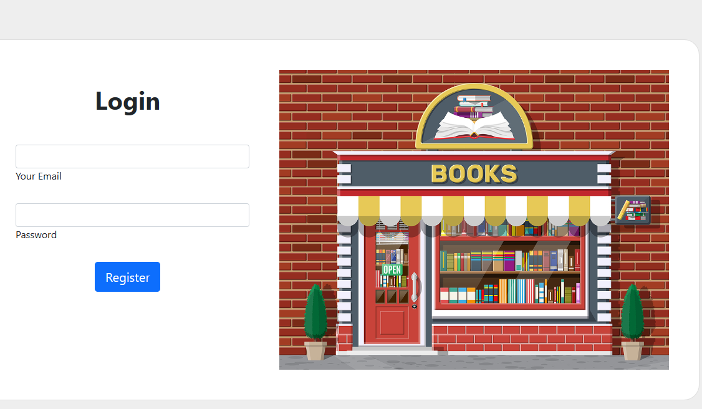
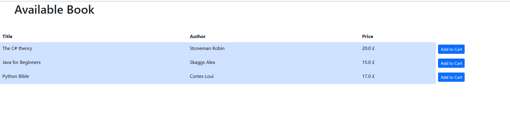
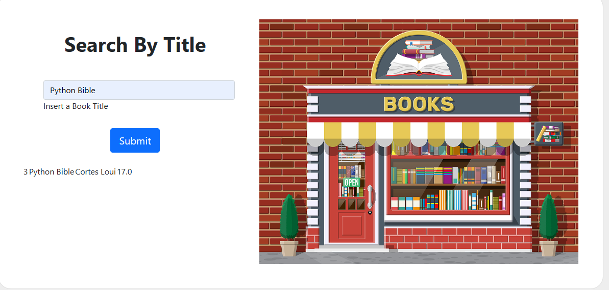
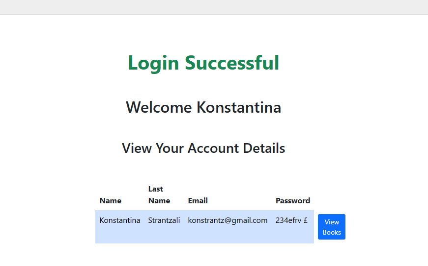

<h1 align ="center">Bookstore App</h1>

 

## Introduction
<h4> This is a 3 tier we Application built in Java, using Servlet +JSP +JDBC and Apatche Tomcat. </h4>

## Features of this Project

Features of the project are demostrated above by using application's screenshots.

-  Registered  User 

  

- Login User

  

- Ability to view list of books displayed by the application

- Ability to search Books by Title. 

- Ability to view accounts personal information.   
For the completion of this task a HttpSession object - sessions were used to store users' values into sessions attributes and put them into use on jsp file.

- Ability to add book to shopping basket.
The logic of storing a session cart and passing the items from UI into the database has been written but not tested due to lack of time.

## Environment

- Eclipse
- Java 17

## Technologies Used

- Bootstrap 5.2
- Apatche Tomcat
- Mysql Connector
- Jira and Confluence was used throughout the building process of the application for tracking the progress and planning the next steps.

### Making a Local Clone

1. Log in to the [GitHub Repository](https://github.com/kpashindla25/ems-KonstantinaStrantzali).
2. Click "Code" above the list of files, where you can Clone or Download the repository.
3. To clone using HTTPS click the clipboard symbol under "Clone with HTTPS".
4. Open Git Bash.
6. Current working directory needs to be changed to the new location, where you want the cloned directory to be.
7. Type `git clone`, and then paste the URL copied in Step 3.
8. Press Enter, to create the local clone.

## Technologies Used
